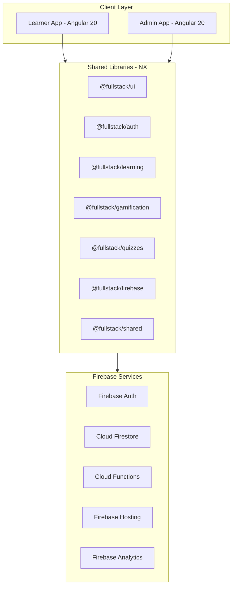
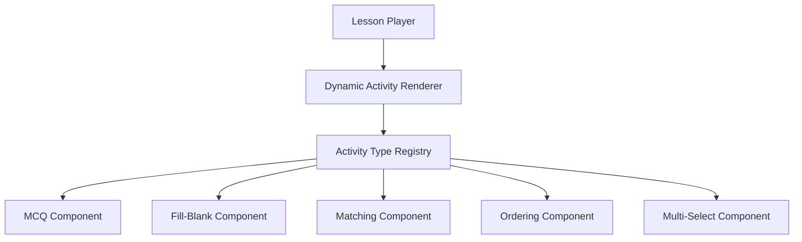

# System Architecture — Detailed Design

## 1. High-Level Architecture



---

## 2. Layered Architecture

```
┌───────────────────────────────────────────────┐
│            PRESENTATION LAYER                 │
│  Pages, Components, Directives, Pipes         │
│  (Angular Standalone Components)              │
├───────────────────────────────────────────────┤
│              STATE LAYER                      │
│  Angular Signals, RxJS, Component Store       │
├───────────────────────────────────────────────┤
│             SERVICE LAYER                     │
│  Business Logic, Orchestration                │
├───────────────────────────────────────────────┤
│           REPOSITORY LAYER                    │
│  Abstract Repos → Firebase Implementations    │
├───────────────────────────────────────────────┤
│              DATA LAYER                       │
│  Firebase SDK, HTTP Client, LocalStorage      │
└───────────────────────────────────────────────┘
```

| Layer | Responsibility | Example |
|-------|---------------|---------|
| **Presentation** | UI rendering, user interaction | `LessonPageComponent`, `McqActivityComponent` |
| **State** | Reactive state, computed values | `LearningStore` with signals |
| **Service** | Business logic orchestration | `LessonService.completeLesson()` |
| **Repository** | Data access abstraction | `UserRepository.getById(id)` |
| **Data** | Raw Firebase/HTTP calls | `FirebaseUserRepository` → Firestore |

---

## 3. Module Communication Rules

Modules communicate ONLY through:

1. **Shared Services** — Injectable services from shared libraries
2. **Router Events** — Navigation with route/query params
3. **Event Bus** — Typed pub/sub for cross-module events
4. **Shared Models** — TypeScript interfaces from `@fullstack/shared`

**Modules must NEVER:**
- Import components from other feature modules
- Access other modules' internal state
- Use global mutable state

---

## 4. Feature Module Boundaries

| Module | Contains | Depends On | Exposes |
|--------|----------|------------|---------|
| **Auth** | Login, Register, Forgot Password, Onboarding | `@fullstack/auth`, `@fullstack/firebase` | AuthGuard, AuthService |
| **Dashboard** | Home, Stats, Quick Actions, Active Paths | `@fullstack/learning`, `@fullstack/gamification` | Nothing (leaf) |
| **Learning** | Journey Map, Lesson Player, Activity Engine | `@fullstack/learning`, `@fullstack/quizzes` | LearningEvents |
| **Gamification** | XP, Leaderboard, Badges, Streaks | `@fullstack/gamification` | XP Popup Overlay |
| **Profile** | User Profile, Settings, History | `@fullstack/auth`, `@fullstack/shared` | Nothing (leaf) |

---

## 5. Dynamic Activity Renderer

The activity engine is config-driven. No hardcoded activity types.



### Activity Registration Pattern

```typescript
// activity-registry.service.ts
@Injectable({ providedIn: 'root' })
export class ActivityRegistryService {
  private registry = new Map<string, Type<ActivityComponent>>();

  register(type: string, component: Type<ActivityComponent>): void {
    this.registry.set(type, component);
  }

  resolve(type: string): Type<ActivityComponent> | undefined {
    return this.registry.get(type);
  }
}

// All activity components implement:
export interface ActivityComponent {
  config: ActivityConfig;
  submitted: EventEmitter<ActivityResult>;
}
```

---

## 6. Backend Abstraction (Repository Pattern)

```typescript
// Abstract (in @fullstack/shared)
export abstract class UserRepository {
  abstract getById(id: string): Observable<User>;
  abstract create(user: User): Observable<void>;
  abstract update(id: string, data: Partial<User>): Observable<void>;
}

// Firebase impl (in @fullstack/firebase)
@Injectable()
export class FirebaseUserRepository extends UserRepository {
  constructor(private firestore: Firestore) { super(); }
  getById(id: string): Observable<User> {
    return docData(doc(this.firestore, `users/${id}`)) as Observable<User>;
  }
  // ...
}

// Provider config
providers: [
  { provide: UserRepository, useClass: FirebaseUserRepository }
]
```

This enables future migration to NestJS/Spring Boot/PostgreSQL **without rewriting features**.

### All Repository Contracts

| Repository | Key Methods | Firestore Collection |
|-----------|-------------|---------------------|
| `UserRepository` | getById, create, update, delete | `users` |
| `LearningPathRepository` | getAll, getById, getByCareer | `learning_paths` |
| `ChapterRepository` | getByTrack, getById | `chapters` |
| `LessonRepository` | getByChapter, getById | `lessons` |
| `ActivityRepository` | getByLesson, getById | `activities` |
| `ProgressRepository` | getUserProgress, updateProgress | `user_progress` |
| `AchievementRepository` | getUserAchievements, unlock | `achievements` |
| `LeaderboardRepository` | getGlobal, getWeekly | `leaderboards` |
| `StreakRepository` | getUserStreak, updateStreak | `streaks` |

---

## 7. State Management (Signals + RxJS)

```typescript
@Injectable({ providedIn: 'root' })
export class LearningStore {
  // Writable signals (private)
  private _currentLesson = signal<Lesson | null>(null);
  private _activityIndex = signal<number>(0);
  private _score = signal<number>(0);
  private _hearts = signal<number>(5);

  // Public readonly
  readonly currentLesson = this._currentLesson.asReadonly();
  readonly activityIndex = this._activityIndex.asReadonly();

  // Computed
  readonly currentActivity = computed(() => {
    const lesson = this._currentLesson();
    return lesson?.activities[this._activityIndex()] ?? null;
  });

  readonly progress = computed(() => {
    const lesson = this._currentLesson();
    if (!lesson) return 0;
    return (this._activityIndex() / lesson.activities.length) * 100;
  });

  readonly isComplete = computed(() => {
    const lesson = this._currentLesson();
    return lesson ? this._activityIndex() >= lesson.activities.length : false;
  });
}
```

---

## 8. Routing Architecture

```typescript
export const appRoutes: Routes = [
  {
    path: '', component: LayoutComponent,
    children: [
      { path: 'dashboard', loadChildren: () => import('./features/dashboard/routes') },
      { path: 'learn', loadChildren: () => import('./features/learning/routes') },
      { path: 'leaderboard', loadChildren: () => import('./features/gamification/routes') },
      { path: 'profile', loadChildren: () => import('./features/profile/routes') },
    ],
    canActivate: [authGuard]
  },
  { path: 'auth', loadChildren: () => import('./features/auth/routes') },
  { path: 'onboarding', loadChildren: () => import('./features/onboarding/routes') },
  { path: '**', redirectTo: 'dashboard' }
];
```

---

## 9. Cross-Module Event Bus

```typescript
type AppEvent =
  | { type: 'LESSON_COMPLETED'; payload: { lessonId: string; score: number } }
  | { type: 'XP_EARNED'; payload: { amount: number; source: string } }
  | { type: 'STREAK_UPDATED'; payload: { streak: number } }
  | { type: 'ACHIEVEMENT_UNLOCKED'; payload: { badge: Badge } }
  | { type: 'LEVEL_UP'; payload: { newLevel: number } };

@Injectable({ providedIn: 'root' })
export class EventBusService {
  private subject = new Subject<AppEvent>();
  events$ = this.subject.asObservable();

  emit(event: AppEvent): void { this.subject.next(event); }

  on<T extends AppEvent['type']>(type: T) {
    return this.events$.pipe(
      filter((e): e is Extract<AppEvent, { type: T }> => e.type === type)
    );
  }
}
```

---

## 10. Module Decommissioning Strategy

Any module removable in 3 steps:

1. Remove the route from `app.routes.ts`
2. Remove the feature flag from Firestore config
3. Delete the module folder

### Feature Flag System

```typescript
@Injectable({ providedIn: 'root' })
export class FeatureFlagService {
  private flags = signal<Record<string, boolean>>({});

  constructor(private firestore: Firestore) {
    onSnapshot(doc(this.firestore, 'config/feature_flags'), (snap) => {
      this.flags.set(snap.data() as Record<string, boolean>);
    });
  }

  isEnabled(feature: string): boolean {
    return this.flags()[feature] ?? false;
  }
}

// Route guard usage
canActivate: [authGuard, featureFlagGuard('gamification.leaderboard')]
```
