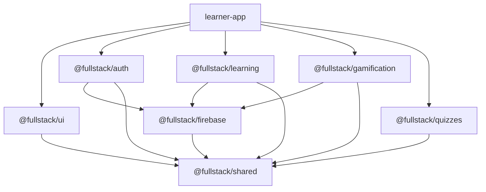

# Project Structure — NX Monorepo

## 1. Monorepo Root

```
fullstack.vvsk.in/
├── apps/
│   ├── learner-app/              # Main learner-facing Angular app
│   └── admin-app/                # Admin CMS Angular app (Phase 2)
├── libs/
│   ├── shared/                   # Shared models, interfaces, utilities
│   │   ├── models/
│   │   ├── interfaces/
│   │   ├── utils/
│   │   ├── constants/
│   │   └── index.ts
│   ├── ui/                       # Shared UI component library
│   │   ├── components/
│   │   ├── directives/
│   │   ├── pipes/
│   │   ├── layouts/
│   │   └── index.ts
│   ├── auth/                     # Authentication library
│   │   ├── services/
│   │   ├── guards/
│   │   ├── interceptors/
│   │   ├── models/
│   │   └── index.ts
│   ├── firebase/                 # Firebase abstraction layer
│   │   ├── repositories/
│   │   ├── services/
│   │   ├── config/
│   │   └── index.ts
│   ├── learning/                 # Learning engine core logic
│   │   ├── services/
│   │   ├── models/
│   │   ├── stores/
│   │   └── index.ts
│   ├── gamification/             # Gamification engine
│   │   ├── services/
│   │   ├── models/
│   │   ├── stores/
│   │   └── index.ts
│   └── quizzes/                  # Activity/quiz engine
│       ├── components/
│       ├── services/
│       ├── models/
│       ├── registry/
│       └── index.ts
├── tools/                        # Build scripts, generators, seeders
│   ├── generators/
│   └── scripts/
├── firebase/                     # Firebase config & cloud functions
│   ├── functions/
│   ├── firestore.rules
│   ├── firestore.indexes.json
│   └── firebase.json
├── nx.json
├── tsconfig.base.json
├── package.json
└── README.md
```

---

## 2. Learner App Structure

```
apps/learner-app/
├── src/
│   ├── app/
│   │   ├── app.component.ts
│   │   ├── app.config.ts
│   │   ├── app.routes.ts
│   │   ├── core/                       # App-level singletons
│   │   │   ├── services/
│   │   │   │   ├── event-bus.service.ts
│   │   │   │   ├── feature-flag.service.ts
│   │   │   │   ├── theme.service.ts
│   │   │   │   └── notification.service.ts
│   │   │   ├── guards/
│   │   │   │   ├── auth.guard.ts
│   │   │   │   ├── onboarding.guard.ts
│   │   │   │   └── feature-flag.guard.ts
│   │   │   ├── interceptors/
│   │   │   │   └── error.interceptor.ts
│   │   │   └── layout/
│   │   │       ├── layout.component.ts
│   │   │       ├── header.component.ts
│   │   │       ├── bottom-nav.component.ts
│   │   │       └── sidebar.component.ts
│   │   │
│   │   └── features/                   # Lazy-loaded feature modules
│   │       ├── auth/
│   │       │   ├── pages/
│   │       │   │   ├── login.page.ts
│   │       │   │   ├── register.page.ts
│   │       │   │   └── forgot-password.page.ts
│   │       │   ├── components/
│   │       │   │   ├── login-form.component.ts
│   │       │   │   ├── register-form.component.ts
│   │       │   │   └── social-login.component.ts
│   │       │   └── routes.ts
│   │       │
│   │       ├── onboarding/
│   │       │   ├── pages/
│   │       │   │   └── onboarding.page.ts
│   │       │   ├── components/
│   │       │   │   ├── welcome-step.component.ts
│   │       │   │   ├── career-step.component.ts
│   │       │   │   ├── level-step.component.ts
│   │       │   │   ├── tech-step.component.ts
│   │       │   │   └── goal-step.component.ts
│   │       │   └── routes.ts
│   │       │
│   │       ├── dashboard/
│   │       │   ├── pages/
│   │       │   │   └── dashboard.page.ts
│   │       │   ├── components/
│   │       │   │   ├── stats-overview.component.ts
│   │       │   │   ├── active-paths.component.ts
│   │       │   │   ├── streak-widget.component.ts
│   │       │   │   ├── daily-goal.component.ts
│   │       │   │   └── continue-learning.component.ts
│   │       │   └── routes.ts
│   │       │
│   │       ├── learning/
│   │       │   ├── pages/
│   │       │   │   ├── journey-map.page.ts
│   │       │   │   ├── lesson-player.page.ts
│   │       │   │   └── lesson-complete.page.ts
│   │       │   ├── components/
│   │       │   │   ├── path-tree/
│   │       │   │   │   ├── path-tree.component.ts
│   │       │   │   │   ├── path-node.component.ts
│   │       │   │   │   └── path-connector.component.ts
│   │       │   │   ├── lesson/
│   │       │   │   │   ├── theory-card.component.ts
│   │       │   │   │   ├── progress-bar.component.ts
│   │       │   │   │   └── hearts-display.component.ts
│   │       │   │   └── activities/
│   │       │   │       ├── activity-renderer.component.ts
│   │       │   │       ├── mcq-activity.component.ts
│   │       │   │       ├── fill-blank-activity.component.ts
│   │       │   │       ├── matching-activity.component.ts
│   │       │   │       ├── ordering-activity.component.ts
│   │       │   │       └── multi-select-activity.component.ts
│   │       │   ├── store/
│   │       │   │   └── learning.store.ts
│   │       │   └── routes.ts
│   │       │
│   │       ├── gamification/
│   │       │   ├── pages/
│   │       │   │   ├── leaderboard.page.ts
│   │       │   │   └── badges.page.ts
│   │       │   ├── components/
│   │       │   │   ├── xp-popup.component.ts
│   │       │   │   ├── streak-celebration.component.ts
│   │       │   │   ├── badge-card.component.ts
│   │       │   │   ├── leaderboard-table.component.ts
│   │       │   │   └── level-up-modal.component.ts
│   │       │   └── routes.ts
│   │       │
│   │       └── profile/
│   │           ├── pages/
│   │           │   ├── profile.page.ts
│   │           │   └── settings.page.ts
│   │           ├── components/
│   │           │   ├── profile-header.component.ts
│   │           │   ├── stats-grid.component.ts
│   │           │   ├── badge-gallery.component.ts
│   │           │   └── learning-history.component.ts
│   │           └── routes.ts
│   │
│   ├── assets/
│   ├── environments/
│   │   ├── environment.ts
│   │   ├── environment.dev.ts
│   │   └── environment.prod.ts
│   ├── styles.css
│   ├── index.html
│   └── main.ts
├── tailwind.config.js
├── project.json
└── tsconfig.app.json
```

---

## 3. Naming Conventions

| Type | Convention | Example |
|------|-----------|---------|
| Component files | `kebab-case.component.ts` | `mcq-activity.component.ts` |
| Page files | `kebab-case.page.ts` | `dashboard.page.ts` |
| Service files | `kebab-case.service.ts` | `event-bus.service.ts` |
| Store files | `kebab-case.store.ts` | `learning.store.ts` |
| Guard files | `kebab-case.guard.ts` | `auth.guard.ts` |
| Model files | `kebab-case.model.ts` | `user.model.ts` |
| Interface files | `kebab-case.interface.ts` | `activity.interface.ts` |
| Route files | `routes.ts` | `routes.ts` (per feature) |
| Component classes | `PascalCase` | `McqActivityComponent` |
| Services | `PascalCase + Service` | `EventBusService` |
| Signals | `camelCase` | `currentLesson`, `isLoading` |
| Constants | `UPPER_SNAKE_CASE` | `MAX_HEARTS`, `XP_PER_LESSON` |

---

## 4. Module Boundary Rules (NX enforce)

```json
// nx.json - module boundary rules
{
  "enforce-module-boundaries": {
    "depConstraints": [
      { "sourceTag": "type:app", "onlyDependOnLibsWithTags": ["type:lib"] },
      { "sourceTag": "type:feature", "onlyDependOnLibsWithTags": ["type:lib", "type:shared"] },
      { "sourceTag": "scope:learner", "onlyDependOnLibsWithTags": ["scope:shared", "scope:learner"] },
      { "sourceTag": "scope:admin", "onlyDependOnLibsWithTags": ["scope:shared", "scope:admin"] }
    ]
  }
}
```

### Dependency Graph



---

## 5. Library Public APIs

Each library exposes a clean public API via `index.ts`:

```typescript
// libs/auth/index.ts
export { AuthService } from './services/auth.service';
export { AuthGuard } from './guards/auth.guard';
export { User, UserProfile } from './models/user.model';
// Internal implementations are NOT exported

// libs/learning/index.ts
export { LessonService } from './services/lesson.service';
export { ProgressService } from './services/progress.service';
export { LearningStore } from './stores/learning.store';
export { Lesson, Chapter, LearningPath, Activity } from './models';
```
