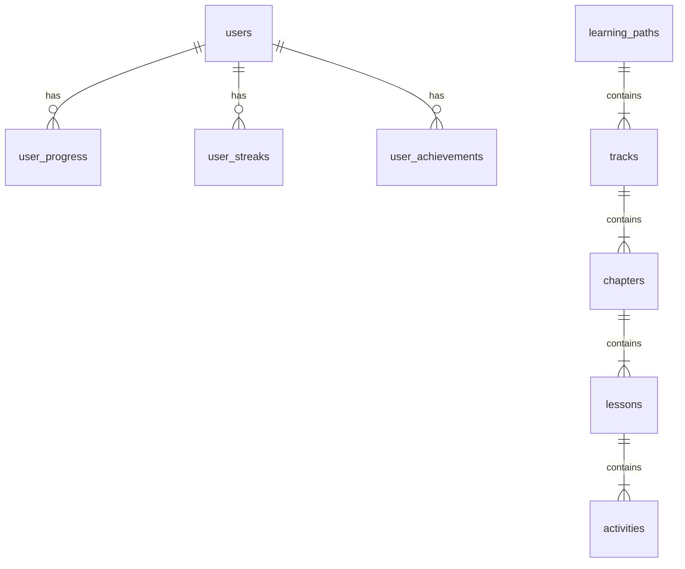

# Data Models — Firestore Schemas

## 1. Collection Map



---

## 2. Users — `users/{userId}`

```typescript
interface User {
  id: string;                    // Firebase Auth UID
  email: string;
  displayName: string;
  photoURL: string | null;
  careerInterest: 'frontend' | 'backend' | 'fullstack' | 'devops' | 'mobile';
  experienceLevel: 'beginner' | 'intermediate' | 'advanced' | 'expert';
  selectedTechnologies: string[];
  dailyGoalMinutes: number;      // 5 | 10 | 15 | 30
  onboardingComplete: boolean;
  totalXP: number;
  currentLevel: number;
  currentStreak: number;
  longestStreak: number;
  lessonsCompleted: number;
  activeLearningPaths: string[];
  role: 'learner' | 'admin';
  notificationsEnabled: boolean;
  theme: 'light' | 'dark' | 'system';
  timezone: string;
  createdAt: Timestamp;
  updatedAt: Timestamp;
  lastActiveAt: Timestamp;
}
```

---

## 3. Learning Paths — `learning_paths/{pathId}`

```typescript
interface LearningPath {
  id: string;
  title: string;                 // "Frontend Engineer"
  description: string;
  icon: string;
  careerPath: string;
  color: string;
  totalXP: number;
  trackCount: number;
  estimatedHours: number;
  difficulty: string;
  tags: string[];
  isPublished: boolean;
  order: number;
  createdAt: Timestamp;
  updatedAt: Timestamp;
}
```

---

## 4. Tracks — `learning_paths/{pathId}/tracks/{trackId}`

```typescript
interface Track {
  id: string;
  pathId: string;
  title: string;                 // "Angular Basics"
  description: string;
  icon: string;
  level: 'beginner' | 'intermediate' | 'advanced' | 'expert';
  chapterCount: number;
  totalXP: number;
  order: number;
  isPublished: boolean;
  prerequisites: string[];       // Track IDs required first
  createdAt: Timestamp;
  updatedAt: Timestamp;
}
```

---

## 5. Chapters — `learning_paths/{pathId}/tracks/{trackId}/chapters/{chapterId}`

```typescript
interface Chapter {
  id: string;
  trackId: string;
  pathId: string;
  title: string;                 // "Components & Templates"
  description: string;
  icon: string;
  lessonCount: number;
  totalXP: number;
  order: number;
  isPublished: boolean;
  createdAt: Timestamp;
}
```

---

## 6. Lessons — `lessons/{lessonId}` (top-level for efficient queries)

```typescript
interface Lesson {
  id: string;
  chapterId: string;
  trackId: string;
  pathId: string;
  title: string;                 // "Data Binding in Angular"
  description: string;
  theoryCards: TheoryCard[];
  activityIds: string[];
  activityCount: number;
  baseXP: number;
  perfectBonusXP: number;
  passingScore: number;          // default 70
  estimatedMinutes: number;
  difficulty: 'easy' | 'medium' | 'hard';
  order: number;
  isPublished: boolean;
  tags: string[];
  createdAt: Timestamp;
  updatedAt: Timestamp;
}

interface TheoryCard {
  id: string;
  order: number;
  type: 'text' | 'code' | 'image' | 'tip' | 'warning';
  title: string;
  content: string;              // Markdown
  codeLanguage?: string;
  imageURL?: string;
}
```

---

## 7. Activities — `activities/{activityId}` (top-level)

```typescript
interface Activity {
  id: string;
  lessonId: string;
  type: 'mcq' | 'fill-blank' | 'matching' | 'ordering' | 'multi-select';
  question: string;
  hint?: string;
  explanation: string;
  difficulty: 'easy' | 'medium' | 'hard';
  xpReward: number;
  order: number;
  data: McqData | FillBlankData | MatchingData | OrderingData | MultiSelectData;
  createdAt: Timestamp;
}

interface McqData {
  options: { id: string; text: string; isCorrect: boolean }[];
}

interface FillBlankData {
  codeTemplate: string;          // "const x = ___;"
  blanks: { id: string; answer: string; position: number; acceptedAnswers: string[] }[];
}

interface MatchingData {
  pairs: { id: string; left: string; right: string }[];
}

interface OrderingData {
  items: { id: string; text: string; correctPosition: number }[];
}

interface MultiSelectData {
  options: { id: string; text: string; isCorrect: boolean }[];
  minSelections: number;
  maxSelections: number;
}
```

---

## 8. User Progress — `user_progress/{userId}/paths/{pathId}`

```typescript
interface UserPathProgress {
  userId: string;
  pathId: string;
  status: 'not_started' | 'in_progress' | 'completed';
  completedTracks: string[];
  currentTrackId: string | null;
  progressPercent: number;
  totalXPEarned: number;
  startedAt: Timestamp;
  lastActivityAt: Timestamp;
}
```

**Lesson progress:** `user_progress/{userId}/lessons/{lessonId}`

```typescript
interface UserLessonProgress {
  userId: string;
  lessonId: string;
  status: 'not_started' | 'in_progress' | 'completed' | 'perfect';
  bestScore: number;
  attempts: number;
  xpEarned: number;
  completedActivities: string[];
  startedAt: Timestamp;
  completedAt: Timestamp | null;
}
```

---

## 9. Streaks — `user_streaks/{userId}`

```typescript
interface UserStreak {
  userId: string;
  currentStreak: number;
  longestStreak: number;
  lastActivityDate: string;      // 'YYYY-MM-DD'
  streakFreezes: number;
  streakHistory: { date: string; completed: boolean; xpEarned: number }[];
  updatedAt: Timestamp;
}
```

---

## 10. Achievements — `user_achievements/{userId}/badges/{badgeId}`

```typescript
interface UserBadge {
  badgeId: string;
  userId: string;
  unlockedAt: Timestamp;
}

// Badge definitions in config/badges
interface BadgeDefinition {
  id: string;
  name: string;                  // "Angular Beginner"
  description: string;
  icon: string;
  category: 'technology' | 'streak' | 'milestone' | 'special';
  condition: {
    type: 'lessons_completed' | 'xp_earned' | 'streak_reached' | 'path_completed';
    target: number;
    filter?: { pathId?: string; technology?: string };
  };
  xpReward: number;
  rarity: 'common' | 'rare' | 'epic' | 'legendary';
}
```

---

## 11. Leaderboard — `leaderboards/{boardId}/entries/{userId}`

```typescript
interface LeaderboardEntry {
  userId: string;
  displayName: string;
  photoURL: string | null;
  totalXP: number;
  level: number;
  rank: number;
  updatedAt: Timestamp;
}
// Board types: 'global', 'weekly', 'technology_{techId}'
```

---

## 12. Config — `config/{configId}`

```typescript
// config/feature_flags
interface FeatureFlags {
  'gamification.leaderboard': boolean;
  'gamification.badges': boolean;
  'gamification.streakFreeze': boolean;
  'learning.codingPlayground': boolean;
  'ai.mentor': boolean;
}

// config/xp_config
interface XPConfig {
  lessonComplete: number;        // e.g. 10
  perfectBonus: number;          // e.g. 5
  streakBonus: number;           // e.g. 2
  levelThresholds: number[];     // [0, 100, 250, 500, 1000, 2000, ...]
}
```

---

## 13. Firestore Indexes

| Collection | Fields | Order |
|-----------|--------|-------|
| `lessons` | pathId, order | ASC, ASC |
| `activities` | lessonId, order | ASC, ASC |
| `leaderboard entries` | totalXP | DESC |
| `user_progress/lessons` | status, completedAt | ASC, DESC |

---

## 14. Security Rules Summary

| Collection | Read | Write |
|-----------|------|-------|
| `users/{uid}` | Own doc | Own doc |
| `learning_paths` | Authenticated | Admin only |
| `lessons` | Authenticated | Admin only |
| `activities` | Authenticated | Admin only |
| `user_progress/{uid}` | Own subcollection | Own subcollection |
| `user_streaks/{uid}` | Own doc | Own doc |
| `user_achievements/{uid}` | Own subcollection | Cloud Functions only |
| `leaderboards` | Authenticated | Cloud Functions only |
| `config` | Authenticated | Admin only |
