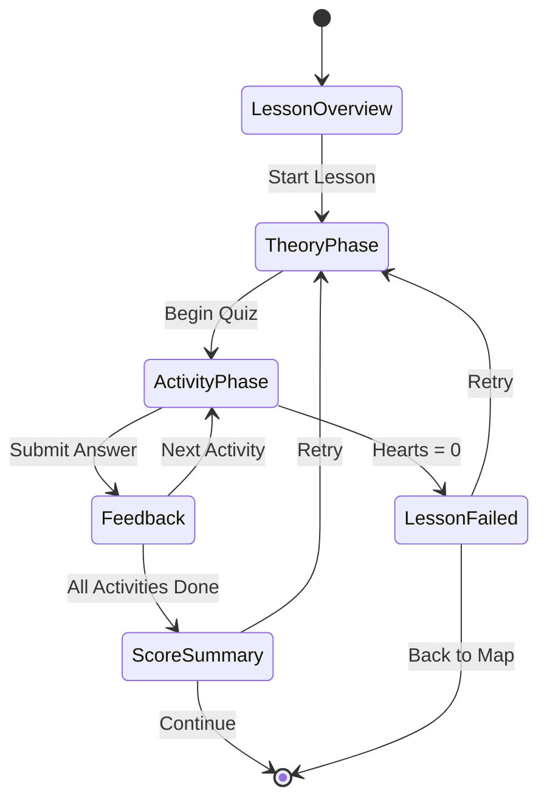

# Learning Engine — Detailed Design

## 1. Learning Hierarchy

```
Career Path (e.g., Frontend Engineer)
  └── Technology (e.g., Angular)
       └── Track (e.g., Angular Basics)
            └── Level: Beginner | Intermediate | Advanced | Expert
                 └── Chapter (e.g., Components & Templates)
                      └── Lesson (e.g., Data Binding)
                           ├── Theory Cards (2-4 cards)
                           └── Activities (5-10 mixed types)
```

---

## 2. Content Progression Model

### Level Traversal (Duolingo-style)

Each track is divided into levels. Users must complete all chapters in a level before advancing:

```
BEGINNER LEVEL
  ├── Chapter 1: Introduction         [5 lessons]
  ├── Chapter 2: Setup & Tooling      [4 lessons]
  └── Chapter 3: Basic Concepts       [6 lessons]
       └── ✅ All complete → Unlock Intermediate

INTERMEDIATE LEVEL (locked until Beginner complete)
  ├── Chapter 4: Advanced Concepts     [6 lessons]
  ├── Chapter 5: Patterns             [5 lessons]
  └── Chapter 6: Best Practices       [4 lessons]
       └── ✅ All complete → Unlock Advanced

ADVANCED LEVEL (locked until Intermediate complete)
  └── ...

EXPERT LEVEL (locked until Advanced complete)
  └── ...
```

### Unlock Rules

| Rule | Condition |
|------|-----------|
| Next lesson in chapter | Previous lesson completed with >= 70% |
| Next chapter | All lessons in current chapter completed |
| Next level | All chapters in current level completed |
| Next track | Current track completed (all levels) |
| Retry | Always available for completed lessons |

---

## 3. Lesson Flow



### Lesson Overview Screen
- Lesson title and description
- Estimated time
- Activity count
- Best score (if attempted before)
- "Start Lesson" / "Continue" / "Retry" button

### Theory Phase
- 2-4 swipeable cards with short explanations
- Card types: text, code snippet, image, tip box, warning box
- "I'm ready!" button to move to activities
- Skip option for returning users

### Activity Phase
- Progress bar at top (current / total activities)
- Hearts display (5 hearts, optional — configurable)
- One activity at a time, full-screen
- Immediate feedback after each answer
- Cannot go back to previous activity

### Score Summary Screen
- Accuracy percentage
- XP earned (with animation)
- Time taken
- Stars (1-3 based on score: 70%=1★, 85%=2★, 100%=3★)
- "Continue" button (back to journey map)
- "Retry" button (if not perfect)

---

## 4. Activity Engine Design

### Activity Lifecycle

```typescript
interface ActivityLifecycle {
  // 1. Load activity config from Firestore
  loadConfig(activityId: string): ActivityConfig;

  // 2. Render activity component dynamically
  renderActivity(config: ActivityConfig): void;

  // 3. User interacts and submits
  onSubmit(answer: any): ActivityResult;

  // 4. Validate answer
  validate(answer: any, config: ActivityConfig): boolean;

  // 5. Show feedback
  showFeedback(result: ActivityResult): void;

  // 6. Award XP and advance
  completeActivity(result: ActivityResult): void;
}
```

### Activity Types — Detailed Behavior

#### MCQ (Multiple Choice Question)
- 4 options displayed as tappable cards
- One correct answer
- On select: highlight selected option
- On submit: green for correct, red for incorrect
- Show explanation below
- Wrong answer: lose 1 heart

#### Fill in the Blanks
- Code block with `___` placeholders
- Input fields or dropdown selectors at blank positions
- Supports multiple blanks per question
- Accepts multiple valid answers (e.g., `let` and `const`)
- Syntax-highlighted code display

#### Matching
- Two columns: concepts and definitions
- Tap one item from left, then tap matching item from right
- Connected pairs shown with colored lines
- All pairs must be matched to submit
- Partial scoring: points per correct pair

#### Ordering / Sequence
- List of items in random order
- Drag-and-drop or tap-to-move reordering
- Submit when user believes order is correct
- Visual numbering of positions

#### Multi-Select
- Checkbox-style options (multiple correct)
- Must select ALL correct answers (no more, no fewer)
- Shows which selections were right/wrong on submit

---

## 5. Content Pipeline

### Content Creation Workflow

```
1. Define Learning Path structure (YAML/JSON)
2. Write theory cards (Markdown)
3. Create activities (JSON config)
4. Upload to Firestore (via admin tool or script)
5. Test lesson flow in dev environment
6. Publish (set isPublished: true)
```

### Example Lesson Config (JSON)

```json
{
  "id": "angular-data-binding-101",
  "title": "Data Binding in Angular",
  "chapterId": "angular-components",
  "trackId": "angular-basics",
  "pathId": "frontend-engineer",
  "theoryCards": [
    {
      "id": "tc-1",
      "order": 1,
      "type": "text",
      "title": "What is Data Binding?",
      "content": "Data binding is a technique to **connect** your component's data to the template..."
    },
    {
      "id": "tc-2",
      "order": 2,
      "type": "code",
      "title": "Interpolation Example",
      "content": "{{ title }}",
      "codeLanguage": "html"
    }
  ],
  "activityIds": ["act-001", "act-002", "act-003", "act-004", "act-005"],
  "baseXP": 10,
  "perfectBonusXP": 5,
  "passingScore": 70,
  "estimatedMinutes": 5,
  "difficulty": "easy",
  "order": 1
}
```

### Content Seeder Tool

A CLI tool (`tools/scripts/seed-content.ts`) to:
- Read content from YAML/JSON files in `tools/content/` directory
- Validate structure against TypeScript interfaces
- Upload to Firestore (dev/prod environment selectable)
- Support incremental updates (upsert mode)

---

## 6. Progress Tracking Logic

### On Lesson Complete

```typescript
async function onLessonComplete(userId: string, lessonId: string, results: ActivityResult[]) {
  const score = calculateScore(results);
  const isPassing = score >= lesson.passingScore;

  if (isPassing) {
    // 1. Save lesson progress
    await progressRepo.saveLessonProgress({
      userId, lessonId,
      status: score === 100 ? 'perfect' : 'completed',
      bestScore: Math.max(score, existingProgress.bestScore),
      xpEarned: calculateXP(score, streak)
    });

    // 2. Check chapter completion
    const chapterComplete = await checkChapterCompletion(userId, lesson.chapterId);
    if (chapterComplete) {
      // 3. Check level/track completion
      await checkTrackProgression(userId, lesson.trackId);
    }

    // 4. Emit events
    eventBus.emit({ type: 'LESSON_COMPLETED', payload: { lessonId, score, xpEarned } });
  }
}
```

### Scoring Formula

```
activityScore = correctAnswers / totalActivities * 100

lessonXP = baseXP
  + (activityScore === 100 ? perfectBonusXP : 0)
  + (streak > 0 ? streakBonus : 0)

stars = activityScore >= 100 ? 3
      : activityScore >= 85  ? 2
      : activityScore >= 70  ? 1
      : 0
```
