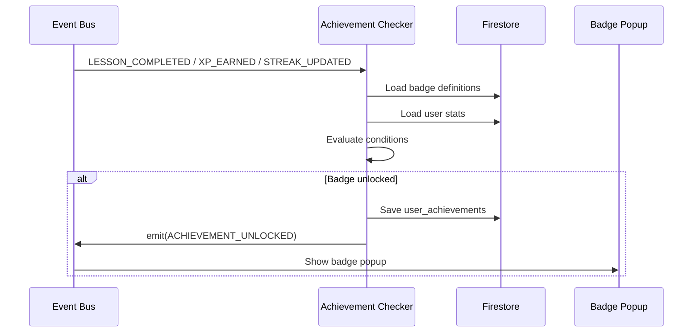

# Gamification Engine — Detailed Design

## 1. Gamification Overview

The gamification system creates an addictive learning loop inspired by Duolingo:

```
Learn → Earn XP → Level Up → Maintain Streak → Earn Badges → Compete → Learn More
```

---

## 2. XP System

### XP Sources

| Source | Base XP | Condition |
|--------|---------|-----------|
| Lesson completion | 10 | Score >= 70% |
| Perfect lesson | +5 | Score = 100% |
| Streak bonus | +2 | Per active streak day |
| Speed bonus | +3 | Complete lesson under time threshold |
| Daily first lesson | +5 | First lesson of the day |
| Chapter completion | +20 | All lessons in chapter done |
| Track completion | +50 | All chapters in track done |
| Path completion | +100 | All tracks in path done |

### XP Calculation

```typescript
function calculateXP(params: {
  baseXP: number;
  score: number;
  perfectBonus: number;
  timeTaken: number;
  timeThreshold: number;
  speedBonus: number;
  currentStreak: number;
  streakBonus: number;
  isFirstLessonToday: boolean;
}): number {
  let xp = params.baseXP;

  if (params.score === 100) xp += params.perfectBonus;
  if (params.timeTaken < params.timeThreshold) xp += params.speedBonus;
  if (params.currentStreak > 0) xp += params.streakBonus;
  if (params.isFirstLessonToday) xp += 5;

  return xp;
}
```

### Level System

| Level | XP Required | Total XP | Title |
|-------|------------|----------|-------|
| 1 | 0 | 0 | Newbie |
| 2 | 100 | 100 | Learner |
| 3 | 150 | 250 | Explorer |
| 4 | 200 | 450 | Apprentice |
| 5 | 300 | 750 | Builder |
| 6 | 400 | 1,150 | Developer |
| 7 | 500 | 1,650 | Craftsman |
| 8 | 700 | 2,350 | Professional |
| 9 | 1,000 | 3,350 | Expert |
| 10 | 1,500 | 4,850 | Master |
| 11-20 | +500 each | ... | Grandmaster → Legend |

### XP Animation Specs

- **+XP Popup**: Floating "+10 XP" text that rises and fades from the activity
- **XP Bar Fill**: Smooth animated progress bar fill on dashboard
- **Level Up**: Full-screen celebration with confetti, new level badge, and sound

---

## 3. Streak System

### Streak Rules

| Rule | Detail |
|------|--------|
| Increment | Complete at least 1 lesson in a calendar day (user's timezone) |
| Reset | Miss a calendar day without completing a lesson |
| Freeze | Use a streak freeze to protect 1 missed day |
| Freeze Earn | Earn 1 freeze per 7-day streak (max 3 stored) |

### Streak Logic

```typescript
function updateStreak(userId: string, timezone: string): StreakUpdate {
  const today = getTodayInTimezone(timezone);  // 'YYYY-MM-DD'
  const streak = getUserStreak(userId);

  if (streak.lastActivityDate === today) {
    return { changed: false };  // Already active today
  }

  const yesterday = getYesterday(timezone);

  if (streak.lastActivityDate === yesterday) {
    // Consecutive day — increment streak
    return {
      changed: true,
      currentStreak: streak.currentStreak + 1,
      longestStreak: Math.max(streak.longestStreak, streak.currentStreak + 1),
      lastActivityDate: today
    };
  }

  // Missed day(s)
  if (streak.streakFreezes > 0 && daysBetween(streak.lastActivityDate, today) <= 2) {
    // Use streak freeze
    return {
      changed: true,
      currentStreak: streak.currentStreak + 1,
      streakFreezes: streak.streakFreezes - 1,
      lastActivityDate: today
    };
  }

  // Streak broken — reset to 1
  return {
    changed: true,
    currentStreak: 1,
    lastActivityDate: today
  };
}
```

### Streak UI Elements

- **Streak Counter**: Flame icon + number on dashboard and header
- **Weekly Calendar**: 7-day row showing completed/missed days
- **Streak Milestones**: Special celebration at 7, 30, 100, 365 days
- **Streak Freeze Indicator**: Snowflake icon with count
- **Streak at Risk**: Warning notification if no activity by evening

---

## 4. Badge System

### Badge Categories

#### Technology Badges
| Badge | Condition | Rarity |
|-------|-----------|--------|
| Angular Beginner | Complete Angular Basics track | Common |
| Angular Intermediate | Complete Angular Intermediate track | Rare |
| Angular Master | Complete all Angular tracks | Epic |
| TypeScript Ninja | Complete TypeScript path | Rare |
| Node.js Builder | Complete Node.js Basics | Common |
| Fullstack Hero | Complete Fullstack path | Legendary |

#### Streak Badges
| Badge | Condition | Rarity |
|-------|-----------|--------|
| First Flame | 3-day streak | Common |
| Week Warrior | 7-day streak | Common |
| Monthly Master | 30-day streak | Rare |
| Century Learner | 100-day streak | Epic |
| Year of Learning | 365-day streak | Legendary |

#### Milestone Badges
| Badge | Condition | Rarity |
|-------|-----------|--------|
| First Step | Complete first lesson | Common |
| Quick Learner | Complete 10 lessons | Common |
| Knowledge Seeker | Complete 50 lessons | Rare |
| Scholar | Complete 100 lessons | Epic |
| XP Hunter | Earn 1,000 XP | Common |
| XP Master | Earn 10,000 XP | Rare |
| Perfectionist | 10 perfect lessons in a row | Epic |

#### Special Badges
| Badge | Condition | Rarity |
|-------|-----------|--------|
| Early Adopter | Register in first month | Legendary |
| Night Owl | Complete a lesson after midnight | Rare |
| Speed Demon | Complete 5 lessons in 1 hour | Rare |

### Badge Unlock Flow



---

## 5. Leaderboard System

### Leaderboard Types

| Type | Scope | Reset |
|------|-------|-------|
| Global | All users, all time | Never |
| Weekly | All users, current week | Every Monday |
| Technology | Users in same learning path | Never |

### Leaderboard Update Strategy

- **Real-time for top 100**: Firestore real-time listener on sorted collection
- **On XP change**: Update user's leaderboard entry document
- **Weekly reset**: Cloud Function runs every Monday at 00:00 UTC

### Leaderboard Entry Display

```
Rank | Avatar | Name        | Level | XP
#1   | 🟡    | Priya S.    | 12    | 4,850 XP
#2   | 🔵    | Arjun K.    | 10    | 3,200 XP
#3   | 🟢    | Rahul M.    | 9     | 2,890 XP
...
#47  | 🟣    | You         | 5     | 750 XP    ← highlighted
```

---

## 6. Celebration & Feedback Animations

| Event | Animation |
|-------|-----------|
| Correct answer | Green flash, checkmark bounce, +XP float |
| Wrong answer | Red shake, heart break animation |
| Lesson complete | Confetti burst, star rating reveal |
| Streak milestone | Fire animation, streak badge unlock |
| Level up | Full-screen confetti, level badge, fanfare |
| Badge unlock | Badge slides in from bottom, glow effect |
| Leaderboard rank up | Arrow animation showing rank change |

### Animation Library
Use Angular Animations (`@angular/animations`) with CSS transitions for:
- `trigger('fadeSlide')` — XP popup
- `trigger('shake')` — Wrong answer
- `trigger('bounce')` — Correct answer
- `trigger('confetti')` — Lesson/level celebrations
- `trigger('slideUp')` — Badge unlock
