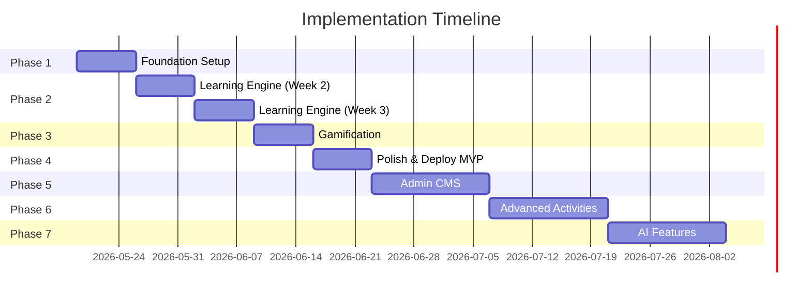

# Phase-wise Implementation Plan — Sprint Breakdown

## Timeline Overview

| Phase | Duration | Focus | Deliverable |
|-------|----------|-------|-------------|
| Phase 1 | Week 1 | Foundation & Auth | Running app with login |
| Phase 2 | Week 2-3 | Learning Engine MVP | Interactive lessons working |
| Phase 3 | Week 4 | Gamification | XP, streaks, leaderboard |
| Phase 4 | Week 5 | Polish & Deploy MVP | Production-ready MVP |
| Phase 5 | Week 6-7 | Admin CMS | Content management |
| Phase 6 | Week 8-9 | Advanced Activities | More activity types |
| Phase 7 | Week 10+ | AI & Enterprise | AI features, scaling |

---

## Phase 1 — Foundation Setup (Week 1)

### Sprint Goal
Set up monorepo, Firebase integration, and complete authentication flow.

### Tasks

| # | Task | Estimated Hours | Depends On |
|---|------|----------------|------------|
| 1.1 | Initialize NX workspace with Angular 20 | 2h | — |
| 1.2 | Create `learner-app` application | 1h | 1.1 |
| 1.3 | Create shared libraries (`shared`, `ui`, `auth`, `firebase`) | 2h | 1.1 |
| 1.4 | Setup Tailwind CSS configuration | 1h | 1.2 |
| 1.5 | Configure design system tokens (colors, typography, spacing) | 2h | 1.4 |
| 1.6 | Create Firebase project (dev environment) | 1h | — |
| 1.7 | Configure `@angular/fire` with environment configs | 1h | 1.2, 1.6 |
| 1.8 | Implement `AuthService` (email + Google login) | 3h | 1.7 |
| 1.9 | Build Login page and Register page | 4h | 1.5, 1.8 |
| 1.10 | Build Auth layout component (split-screen design) | 2h | 1.5 |
| 1.11 | Implement auth guard and guest guard | 1h | 1.8 |
| 1.12 | Build app shell layout (header + bottom nav + router outlet) | 3h | 1.5 |
| 1.13 | Setup routing architecture with lazy loading | 2h | 1.2 |
| 1.14 | Create base UI components (Button, Card, Input, Avatar) | 4h | 1.5 |
| 1.15 | Setup ESLint, Prettier, conventional commits | 1h | 1.1 |
| 1.16 | Setup GitHub repository and initial CI pipeline | 2h | 1.1 |
| 1.17 | Write Firestore security rules (initial) | 1h | 1.6 |
| 1.18 | Build Forgot Password page | 1h | 1.8 |

**Total: ~32 hours | Sprint Points: 32**

### Deliverables
- Running Angular app in NX workspace
- Firebase Auth working (email + Google)
- Login, Register, Forgot Password pages
- App shell with header and bottom navigation
- Base UI component library
- CI pipeline running lint + build

---

## Phase 2 — Learning Engine MVP (Week 2-3)

### Sprint Goal
Build the core learning experience — onboarding, journey map, lesson player, and activity engine.

### Week 2 Tasks

| # | Task | Estimated Hours | Depends On |
|---|------|----------------|------------|
| 2.1 | Build Onboarding wizard (5-step flow) | 6h | Phase 1 |
| 2.2 | Implement onboarding guard (redirect if not onboarded) | 1h | 2.1 |
| 2.3 | Create `@fullstack/learning` library with models | 2h | Phase 1 |
| 2.4 | Build `LearningPathRepository` (Firestore) | 2h | 2.3 |
| 2.5 | Build Dashboard page with stats overview | 4h | Phase 1 |
| 2.6 | Build Active Paths cards component | 2h | 2.5 |
| 2.7 | Build Streak widget component | 2h | 2.5 |
| 2.8 | Build Continue Learning component | 2h | 2.5 |
| 2.9 | Build Journey Map page (Duolingo-style tree) | 8h | 2.4 |
| 2.10 | Build Path Node component (locked/available/completed states) | 4h | 2.9 |
| 2.11 | Build Path Connector component (SVG lines) | 2h | 2.9 |

**Week 2 Total: ~35 hours**

### Week 3 Tasks

| # | Task | Estimated Hours | Depends On |
|---|------|----------------|------------|
| 2.12 | Build Lesson Player page container | 3h | 2.9 |
| 2.13 | Build Theory Card component (text, code, image, tip) | 4h | 2.12 |
| 2.14 | Build Progress Bar component | 1h | 2.12 |
| 2.15 | Build Hearts Display component | 1h | 2.12 |
| 2.16 | Create `@fullstack/quizzes` library | 2h | Phase 1 |
| 2.17 | Build Activity Registry service | 2h | 2.16 |
| 2.18 | Build Dynamic Activity Renderer component | 3h | 2.17 |
| 2.19 | Build MCQ Activity component | 4h | 2.18 |
| 2.20 | Build Fill-in-Blank Activity component | 4h | 2.18 |
| 2.21 | Build Matching Activity component | 4h | 2.18 |
| 2.22 | Build Feedback Overlay component (correct/incorrect) | 2h | 2.18 |
| 2.23 | Build Lesson Complete page (score summary) | 3h | 2.12 |
| 2.24 | Implement `LearningStore` (signals-based state) | 3h | 2.12 |
| 2.25 | Implement progress tracking (save to Firestore) | 3h | 2.24 |
| 2.26 | Build content seeder script | 3h | 2.3 |
| 2.27 | Seed initial content (Angular Basics — 2 chapters, 8 lessons) | 4h | 2.26 |

**Week 3 Total: ~46 hours**

### Deliverables
- Onboarding wizard working
- Dashboard with stats and active paths
- Journey map with node states and navigation
- Lesson player with theory cards
- MCQ, Fill-in-blank, and Matching activities working
- Progress saved to Firestore
- Initial learning content seeded

---

## Phase 3 — Gamification (Week 4)

### Sprint Goal
Add XP system, streaks, badges, leaderboard, and celebration animations.

| # | Task | Estimated Hours | Depends On |
|---|------|----------------|------------|
| 3.1 | Create `@fullstack/gamification` library | 2h | Phase 2 |
| 3.2 | Implement XP calculation service | 3h | 3.1 |
| 3.3 | Implement Streak tracking service | 3h | 3.1 |
| 3.4 | Build XP popup animation component | 3h | 3.2 |
| 3.5 | Build Streak celebration component | 2h | 3.3 |
| 3.6 | Build Level-up modal component | 3h | 3.2 |
| 3.7 | Implement Event Bus service | 2h | Phase 2 |
| 3.8 | Wire gamification events (lesson complete → XP → streak → badges) | 3h | 3.7 |
| 3.9 | Implement Badge definition system (config-driven) | 3h | 3.1 |
| 3.10 | Build Badge card and gallery components | 3h | 3.9 |
| 3.11 | Build Badge unlock popup component | 2h | 3.9 |
| 3.12 | Build Leaderboard page (global + weekly) | 4h | 3.1 |
| 3.13 | Build Leaderboard table component | 2h | 3.12 |
| 3.14 | Implement Feature Flag service | 2h | Phase 1 |
| 3.15 | Implement Feature Flag guard | 1h | 3.14 |
| 3.16 | Update Dashboard with gamification widgets | 2h | 3.2, 3.3 |
| 3.17 | Add celebration animations (confetti, bounce, shake) | 4h | 3.4 |

**Total: ~44 hours**

### Deliverables
- XP earned on lesson completion with animated popups
- Streak tracking with daily calendar widget
- Badge system with unlock notifications
- Global and weekly leaderboard
- Feature flag system
- Celebration animations throughout the app

---

## Phase 4 — Polish & Deploy MVP (Week 5)

### Sprint Goal
Profile page, responsive polish, testing, and production deployment.

| # | Task | Estimated Hours | Depends On |
|---|------|----------------|------------|
| 4.1 | Build Profile page (header, stats, badges) | 4h | Phase 3 |
| 4.2 | Build Settings page (theme, notifications, goal) | 3h | 4.1 |
| 4.3 | Build Learning History component | 2h | 4.1 |
| 4.4 | Implement dark mode (ThemeService + CSS) | 4h | Phase 1 |
| 4.5 | Responsive testing and fixes (mobile, tablet, desktop) | 6h | All |
| 4.6 | Implement loading skeletons across all pages | 3h | All |
| 4.7 | Implement empty states across all pages | 2h | All |
| 4.8 | Implement error handling and toast notifications | 3h | All |
| 4.9 | Write unit tests for core services (auth, learning, gamification) | 6h | All |
| 4.10 | Write component tests for critical components | 4h | All |
| 4.11 | Setup Firebase Hosting for production | 2h | Phase 1 |
| 4.12 | Setup production Firebase project and config | 2h | 4.11 |
| 4.13 | Configure GitHub Actions for deploy pipeline | 3h | 4.11 |
| 4.14 | Seed production content | 2h | 4.12 |
| 4.15 | Performance optimization (bundle size, lazy loading audit) | 3h | All |
| 4.16 | Lighthouse audit and fixes | 2h | 4.15 |
| 4.17 | Deploy MVP to production | 1h | All above |

**Total: ~50 hours**

### Deliverables
- Complete MVP deployed to production
- Profile and settings pages
- Dark mode support
- Responsive across devices
- Loading and error states
- Core test coverage > 60%
- Lighthouse score > 90

---

## Phase 5 — Admin CMS (Week 6-7)

| # | Task | Estimated Hours |
|---|------|----------------|
| 5.1 | Create `admin-app` in NX workspace | 2h |
| 5.2 | Build Admin layout and navigation | 4h |
| 5.3 | Build Admin login with role check | 2h |
| 5.4 | Build Admin dashboard with analytics | 6h |
| 5.5 | Build Learning Path CRUD pages | 6h |
| 5.6 | Build Track management within paths | 4h |
| 5.7 | Build Lesson editor with theory card builder | 8h |
| 5.8 | Build Activity builder (MCQ, Fill, Match) | 8h |
| 5.9 | Build Feature Flag management page | 3h |
| 5.10 | Build XP configuration page | 2h |
| 5.11 | Build User management list and detail | 4h |
| 5.12 | Deploy admin app to separate Firebase Hosting target | 2h |

**Total: ~51 hours**

---

## Phase 6 — Advanced Activities (Week 8-9)

| # | Task | Estimated Hours |
|---|------|----------------|
| 6.1 | Build Ordering/Sequence activity component | 6h |
| 6.2 | Build Multi-Select activity component | 4h |
| 6.3 | Build Drag-and-Drop activity component (CDK) | 8h |
| 6.4 | Build Code Playground with Monaco Editor | 12h |
| 6.5 | Implement activity type discovery (add type, register, done) | 4h |
| 6.6 | Seed advanced activity content | 4h |
| 6.7 | Update admin CMS with new activity builders | 6h |

**Total: ~44 hours**

---

## Phase 7 — AI & Enterprise (Week 10+)

| # | Task | Estimated Hours |
|---|------|----------------|
| 7.1 | Integrate OpenAI API via Cloud Functions | 6h |
| 7.2 | AI quiz generation from lesson content | 8h |
| 7.3 | AI mentor chat interface | 12h |
| 7.4 | AI weakness analysis and recommendations | 8h |
| 7.5 | Push notifications for streak reminders | 4h |
| 7.6 | PWA support (offline, install prompt) | 6h |
| 7.7 | Enterprise team features (future scoping) | — |

---

## Dependency Graph

